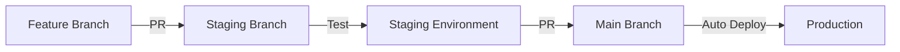

# Development Workflow Guide

This guide covers the day-to-day development workflow for the Golden Knight Lounge project, following the Feature → Staging → Production deployment pipeline.

## Workflow Overview



## Branch Strategy

### Protected Branches
- **main**: Production code (protected, requires PR)
- **staging**: Testing environment (protected, requires tests)

### Working Branches
- **develop**: Integration branch (optional)
- **feature/[issue-number]-[description]**: New features
- **bugfix/[issue-number]-[description]**: Bug fixes
- **hotfix/[issue-number]-[description]**: Critical production fixes

## Standard Development Flow

### Step 1: Start New Work

#### 1.1 Create or Review Issue
```bash
# View available issues
gh issue list

# Create new issue
gh issue create --title "Feature: Add player stats" --body "Description..."
```

#### 1.2 Sync Your Local Repository
```bash
# Always start from updated staging
git checkout staging
git pull origin staging

# Ensure staging has latest from main
git pull origin main
git push origin staging
```

#### 1.3 Create Feature Branch
```bash
# Branch from staging
git checkout -b feature/123-add-player-stats

# For bug fixes
git checkout -b bugfix/124-fix-oauth-redirect
```

### Step 2: Development

#### 2.1 Make Changes
- Write tests first (TDD approach)
- Implement feature/fix
- Update documentation if needed
- Follow code style guidelines

#### 2.2 Test Locally
```bash
# Run backend tests
cd backend
pytest tests/ -v

# Run linting
flake8 src/

# Test the application
python src/app.py
```

See [Local Testing Guide](./local-testing.md) for detailed instructions.

#### 2.3 Commit Changes
```bash
# Stage changes
git add .

# Commit with descriptive message
git commit -m "feat: Add player statistics endpoint

- Implement /api/players/stats endpoint
- Add caching for performance
- Include unit tests

Relates to #123"
```

### Step 3: Deploy to Staging

#### 3.1 Push Feature Branch
```bash
git push origin feature/123-add-player-stats
```

#### 3.2 Create Pull Request to Staging
```bash
# Using GitHub CLI
gh pr create \
  --base staging \
  --head feature/123-add-player-stats \
  --title "feat: Add player statistics endpoint" \
  --body "## Summary
  Adds new endpoint for player statistics
  
  ## Testing
  - [x] Unit tests pass
  - [x] Manual testing complete
  - [ ] Staging deployment verified
  
  Closes #123"

# Or use GitHub web interface
```

#### 3.3 Review and Merge
1. Wait for CI checks to pass
2. Request code review if required
3. Merge PR to staging
4. **Automatic deployment** to staging environment

#### 3.4 Verify Staging Deployment
```bash
# Check deployment status
curl https://staging.goldenknightlounge.com/api/health

# Test new features
# Monitor logs in Replit staging console
```

### Step 4: Promote to Production

After thorough testing in staging:

#### 4.1 Create PR from Staging to Main
```bash
# Ensure staging is up to date
git checkout staging
git pull origin staging

# Create PR
gh pr create \
  --base main \
  --head staging \
  --title "Release: Deploy tested features to production" \
  --body "## Release Summary
  - feat: Player statistics endpoint (#123)
  - fix: OAuth redirect issue (#124)
  
  ## Staging Testing
  - [x] All features tested in staging
  - [x] No critical issues found
  - [x] Performance acceptable
  
  ## Deployment Checklist
  - [x] Database migrations ready
  - [x] Environment variables configured
  - [x] Monitoring alerts configured"
```

#### 4.2 Production Deployment
1. Review PR carefully
2. Ensure all CI checks pass
3. Merge PR to main
4. **Automatic deployment** to production

#### 4.3 Verify Production
```bash
# Check production health
curl https://goldenknightlounge.com/api/health

# Monitor for issues
# Check Replit production logs
# Watch error tracking (if configured)
```

## Special Workflows

### Hotfix to Production

For critical production issues:

```bash
# 1. Create hotfix from main
git checkout main
git pull origin main
git checkout -b hotfix/125-critical-bug

# 2. Make fix and test thoroughly
# ... make changes ...
git add .
git commit -m "hotfix: Fix critical authentication bug"

# 3. PR directly to main
gh pr create --base main --title "HOTFIX: Critical auth bug"

# 4. After merge, backport to staging
git checkout staging
git pull origin main
git push origin staging
```

### Keeping Branches in Sync

#### Sync Staging with Main (Regular)
```bash
# After each production deployment
git checkout staging
git pull origin staging
git pull origin main
git push origin staging
```

#### Reset Staging (Nuclear Option)
```bash
# WARNING: Loses staging-only changes
git checkout staging
git fetch origin
git reset --hard origin/main
git push origin staging --force
```

### Multiple Features in Parallel

When working on multiple features:

```bash
# Feature A
git checkout staging
git checkout -b feature/100-feature-a
# ... work ...
gh pr create --base staging

# Feature B (while A is in review)
git checkout staging  # Not from feature-a!
git checkout -b feature/101-feature-b
# ... work ...
gh pr create --base staging
```

## Code Review Guidelines

### For Authors
- Keep PRs focused and small
- Write clear PR descriptions
- Include test instructions
- Link related issues
- Respond to feedback promptly

### For Reviewers
- Check code quality and style
- Verify tests are included
- Test the changes locally if needed
- Provide constructive feedback
- Approve or request changes clearly

## Commit Message Convention

Follow conventional commits:

```
type(scope): subject

body (optional)

footer (optional)
```

Types:
- `feat`: New feature
- `fix`: Bug fix
- `docs`: Documentation
- `style`: Formatting
- `refactor`: Code restructuring
- `test`: Adding tests
- `chore`: Maintenance

Examples:
```bash
git commit -m "feat(auth): Add OAuth token refresh"
git commit -m "fix(api): Handle null player stats"
git commit -m "docs: Update deployment workflow"
```

## CI/CD Pipeline

### GitHub Actions Checks

On every PR:
1. Run unit tests
2. Check code linting
3. Verify build succeeds
4. Check test coverage

### Replit Auto-Deployment

| Branch Update | Deploys To | URL |
|--------------|------------|-----|
| staging | Staging Environment | https://staging.goldenknightlounge.com |
| main | Production | https://goldenknightlounge.com |

## Rollback Procedures

### Quick Rollback in Production

If something breaks after deployment:

#### Option 1: Revert Commit
```bash
# Revert the last merge
git checkout main
git pull origin main
git revert -m 1 HEAD
git push origin main
# Auto-deploys the revert
```

#### Option 2: Replit Rollback
1. Go to Replit production project
2. Deployments → History
3. Find last working deployment
4. Click "Redeploy"

### Staging Rollback

Similar process but for staging branch:
```bash
git checkout staging
git revert HEAD
git push origin staging
```

## Monitoring and Debugging

### Check Deployment Status

#### GitHub Actions
- Repository → Actions tab
- View workflow runs
- Check for failures

#### Replit Console
- Deployments → Logs
- Real-time application logs
- Error messages

### Debug Failed Deployments

1. **Check GitHub Actions**:
   - What test failed?
   - Build errors?

2. **Check Replit Logs**:
   - Deployment logs
   - Runtime errors
   - Missing environment variables?

3. **Common Issues**:
   - Missing dependencies in requirements.txt
   - Environment variable not set
   - Database migration needed
   - Port conflicts

## Best Practices

### Do's ✅
- Always branch from staging for features
- Test locally before pushing
- Keep PRs small and focused
- Write descriptive commit messages
- Update documentation with code changes
- Test in staging before production
- Monitor after deployments

### Don'ts ❌
- Don't push directly to main or staging
- Don't merge without CI passing
- Don't skip staging testing
- Don't merge large PRs without review
- Don't forget to sync branches
- Don't ignore failing tests

## Quick Command Reference

```bash
# Start new feature
git checkout staging && git pull
git checkout -b feature/xxx-description

# Submit for staging
git push origin feature/xxx-description
gh pr create --base staging

# Sync staging with main
git checkout staging
git pull origin main
git push origin staging

# Deploy to production
gh pr create --base main --head staging

# Hotfix
git checkout main && git pull
git checkout -b hotfix/xxx-critical
# fix, test, push
gh pr create --base main

# Check deployment
curl https://staging.goldenknightlounge.com/api/health
curl https://goldenknightlounge.com/api/health
```

## Troubleshooting

### PR Won't Merge
- Check CI status - all green?
- Conflicts? Resolve locally and push
- Reviews required? Request review

### Staging Not Updating
- Check Replit staging console
- Is branch connection active?
- Manual redeploy in Replit

### Tests Failing in CI but Pass Locally
- Check Python version matches
- Environment variables set in CI?
- Database setup different?

### Can't Create PR
- Do you have push access?
- Is base branch protected?
- Are you up to date with base?

## Getting Help

- Check existing issues: `gh issue list`
- Ask in team chat/Discord
- Review logs carefully
- Check [Local Testing Guide](./local-testing.md)
- Review [Initial Deployment](./initial-deployment.md) for setup issues

---
*Last Updated: [Current Date]*
*For local development setup, see [Local Testing Guide](./local-testing.md)*